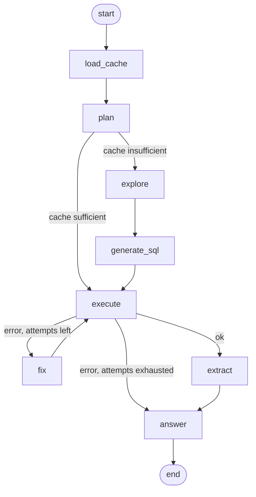

# sql-agent

A self-optimizing SQL agent that gets cheaper with every question.

Point it at PostgreSQL, MySQL/MariaDB or SQLite.


## Overview

End to end on `claude-opus-5`, from a cold cache:

| Turn | Explored | Tokens | Time | Answer |
|---|---|---:|---:|---|
| T1 — how many customers do we have? | 5 tool calls | **11,505** | 34s | 1,840 ✓ |
| T2 — the same question again | **none** | **371** | 8s | 1,840 ✓ |
| T3 — how many in the west region? | **none** | 475 | 6s | 460 ✓ |
| T4 — orders per quarter? | 3 tool calls | **14,254** | 48s | 9 quarters ✓ |
| T5 — project the next two quarters | **none** | **1,416** | 10s | a least-squares fit ✓ |

**T1** primes the agent's memory.

**T2** is the same question and the same answer, but cheaper now. 

**T3** had never been asked, but costs about the same as T2.

**T4** goes up again, and that is the honest shape of the claim: T1–T3 are all
about `customer`, and `orders` is a part of the schema the agent has never seen.
It does not get cheaper at everything — it gets cheaper at what it has seen.

**T5** is the one worth watching. Nothing in the cache is a forecast. What T4
filed away is that orders are dated by `created` rather than `created_at`, that
`status` includes cancellations, and how to bucket them into quarters — and from
those three facts the agent writes a least-squares fit with `regr_slope` and
projects two quarters forward, without opening the schema again.

## Quickstart

```bash
make up && make migrate && make seed   # two databases + API, then 2,000 customers
make demo                              # generate demo video
make cache                             # what it learned, as the model sees it
make turns                             # tokens per turn
```

Copy `.env.example` to `.env` and pick a provider: `PROVIDER=anthropic` for the
demo model, or `PROVIDER=openai_compat` with `OPENAI_BASE_URL` / `OPENAI_MODEL`
for anything OpenAI-shaped (Ollama, vLLM, LM Studio).

## The CLI

`sql-agent` is the client — it talks to the server over HTTP and never touches a
database itself. Against a local `make up` it needs no configuration:

```bash
uv run sql-agent connections ls
```

Put the venv on your PATH and you can drop the `uv run`:

```bash
export PATH="$PWD/.venv/bin:$PATH"
```

Two environment variables point it somewhere else, both optional:

```bash
SQL_AGENT_URL=http://localhost:8000/v1   # the default; the /v1 is part of it
SQL_AGENT_API_KEY=...                    # only if the server has API_TOKEN set
```

```bash
# Point it at a database. `default` is TARGET_DATABASE_URL, already registered.
sql-agent connections create warehouse \
    --hostname db.internal --database analytics --username reader
sql-agent connections create reporting --driver mysql+asyncmy \
    --hostname mysql.internal --database reporting --username reader
sql-agent connections create books --driver sqlite+aiosqlite \
    --database /data/books.db          # sqlite is a path and nothing else
sql-agent connections ls
sql-agent connect warehouse

# Ask. The subcommand is optional — a bare argument is a question.
sql-agent "how many customers do we have?"
sql-agent -v "how many customers are in the west region?"   # show the work

# What it learned, and what each turn cost.
sql-agent cache
sql-agent turns
sql-agent reset          # forget it all, for one connection
```

Every command takes `-c/--connection` to override the connected one. Give the
agent a role holding `SELECT` and nothing else: it only ever reads, and the
session it opens is read-only regardless, but that is a guarantee about the
agent rather than about the credentials you handed it.

**What the agent learns belongs to the connection it learned it about.** Ask
`warehouse` about revenue and `staging` knows nothing about it — `revenue` means
something different on each, and one shared cache would let them overwrite each
other.

## Architecture

### LangGraph Workflow



### API

The agent runs behind one server, and `sql-agent` is a terminal renderer for
these endpoints — there is no second code path, and the CLI imports nothing from
the server.

```
GET    /v1/connections                the registry — never a password
POST   /v1/connections                register a database
GET    /v1/connections/{id}           one, with cache and turn counts
PATCH  /v1/connections/{id}           partial update
DELETE /v1/connections/{id}           the row, and everything learned about it
POST   /v1/connections/{id}/test      can we reach it, and what are we?
POST   /v1/connections/{id}/ask       one turn, streamed as SSE
GET    /v1/connections/{id}/cache     what it learned, exactly as the model reads it
DELETE /v1/connections/{id}/cache     forget it — cache, turns, checkpoints
GET    /v1/connections/{id}/turns     tokens per turn
GET    /health                        unversioned and open, for a load balancer
```

Everything about learned state hangs off the connection it is about, as a path
segment: there is no unscoped route to reach by accident, because it doesn't
exist.

Everything under `/v1` takes `Authorization: Bearer $API_TOKEN`. Leaving
`API_TOKEN` unset leaves it open, which the server warns about at startup — as
does leaving `CONNECTION_SECRET` unset, which stores registered warehouse
passwords in plaintext.

`make up` starts both databases and the API together, with `app/` mounted and
`--reload` — an edit restarts the server in place, and only a dependency change
needs `make build`.

### One memory, N targets

The agent's memory is on its **own Postgres server**, separate from every
database it answers questions about.

| | `agent-db` :5433 | a target |
|---|---|---|
| holds | the registry, and what the agent has learned | the business data |
| engine | Postgres, always | PostgreSQL, MySQL/MariaDB or SQLite |
| how many | one | however many are registered |

So the agent can't explore its own cache and cache facts about caching. That
doesn't rest on application code remembering to check: `sql-agent reset` cannot
touch the business data because that connection cannot see it.

The two halves speak different libraries — the agent's memory is psycopg, targets
are SQLAlchemy — and they are physically incompatible, so passing one where the
other belongs is a type error rather than a subtle bug.

Generated SQL can't write either, and this one is worth being precise about.
`demo/demo.sql` builds a `reader` role holding SELECT and nothing else — but a
*registered* connection's credentials are whatever you gave us, so the guarantee
cannot live there. Every connection the agent opens is put into a read-only
session, which binds any role including a superuser.

**How far that goes depends on the engine, and the agent tells you which.**

| | writes blocked | runaway query killed | |
|---|---|---|---|
| PostgreSQL | ✓ | ✓ | `enforced` |
| MySQL / MariaDB | ✓ | ✓ | `enforced` |
| SQLite | ✓ | ✗ — it has no statement timeout | `partial` |

Registration is never refused over this. A connection that cannot promise
everything says so when you create it and carries its tier in
`sql-agent connections get`. An undisclosed gap and an undisclosed hole are the
same bug.

### Watching a turn

The token counter says a turn cost 11,500 tokens. Tracing says where they went.

```bash
make langfuse-up   # six containers, ~2GB, UI on http://localhost:3000
```

Then uncomment `LANGFUSE_PUBLIC_KEY` and `LANGFUSE_SECRET_KEY` in `.env` and run
`docker compose up -d api` — `restart` reuses the environment the container was
created with. The stack seeds itself with that key pair, so there is nothing to
click through first; log in as `dev@sql-agent.local` / `sql-agent-dev`.

Every turn becomes one trace — a span per graph node, a generation per model call
with its tokens and its prompt-cache reads, and a span per introspection tool
call, which is the 24 that the turn table shows you as the number 24. T1 and T2
side by side are the whole argument of this project in one screen. Each turn
carries the trace it was recorded as — `turn.trace_id`, on the row and on
`GET /v1/connections/{id}/turns` — so a number on the chart leads back to the
calls that produced it.

It is **off** unless both keys are set, and off costs nothing: no client is built
and `langfuse` is never imported. On, the trace holds the question, the prompts,
the generated SQL and the rows handed back to the model. The stack is
self-hosted, so none of that leaves your machine — but it does mean the trace
store holds whatever the warehouse you pointed it at holds.

`demo/demo.sql` is not the product — it's a booby-trapped fixture so the agent
has something to explore, which is why it sits next to the tape that records it.
Point `TARGET_DATABASE_URL` at a real warehouse, or register one with
`sql-agent connections create`, and nothing else changes.

To re-record the demo above:

```bash
make demo          # live take
make demo-verify   # check the take from the turn table
```

`make demo` needs [VHS](https://github.com/charmbracelet/vhs).

## Design

See [PLAN.md](PLAN.md) for architecture details and the build plan.